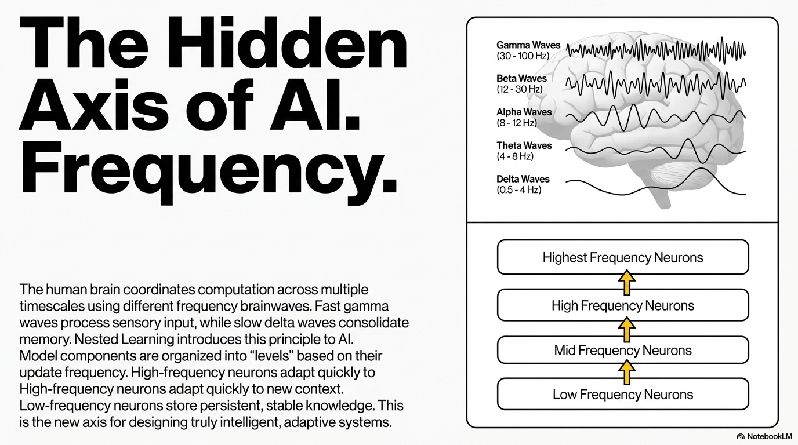
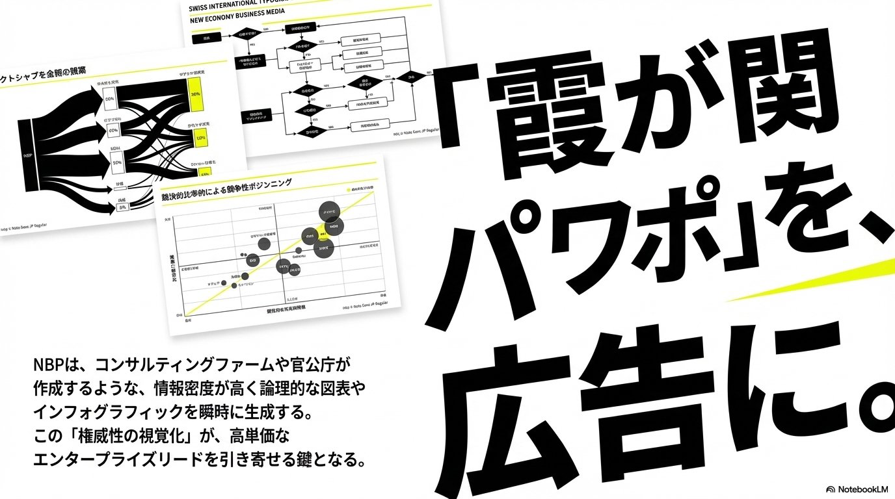
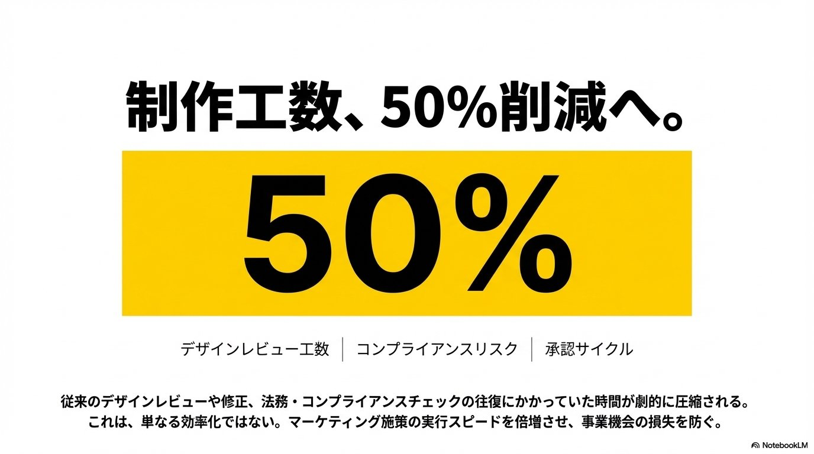

# Walter AI Prompt Library

A curated awesome-style library of AI prompts for project managers, NotebookLM slide creators, Power BI builders, construction professionals, and business workflows.

Use this README as the main catalog. You should not need to open every folder just to discover what is inside.

Inspired by the awesome-list browsing style used by [awesome-notebookLM-prompts](https://github.com/serenakeyitan/awesome-notebookLM-prompts).

## Table of Contents

- [NotebookLM Slide Prompts](#notebooklm-slide-prompts)
- [Slide Prompts](#slide-prompts)
- [Image Prompts](#image-prompts)
- [Video Prompts](#video-prompts)
- [LLM Prompts](#llm-prompts)
- [Power BI Prompts](#power-bi-prompts)
- [Construction Project Prompts](#construction-project-prompts)
- [Project Management Prompts](#project-management-prompts)
- [Business Strategy Prompts](#business-strategy-prompts)
- [Prompt Standard](#prompt-standard)

## NotebookLM Slide Prompts

Prompts designed specifically for NotebookLM slide generation, visual storytelling, and premium business-media style decks.

### Smartphone Business Media / Modern Newspaper

A high-impact NotebookLM slide prompt inspired by Japanese new economy business media, Swiss Style, Bauhaus, bold asymmetry, massive typography, white/black/yellow contrast, and smartphone-first editorial design.

[Open prompt](01-slide-prompts/notebooklm-smartphone-business-media-slides.md)

## Slide Prompts

Premium presentation prompts for NotebookLM, Kael, Gamma, ChatGPT, Claude, and executive deck workflows.

- [NotebookLM Smartphone Business Media Slides](01-slide-prompts/notebooklm-smartphone-business-media-slides.md) - Smartphone-first business media slides with bold editorial typography.
- [Anti-Gravity / Living Artifact Presentation](01-slide-prompts/anti-gravity-living-artifact.md) - Cinematic executive decks that feel like premium strategic artifacts.
- [Minimal Premium Deck](01-slide-prompts/minimal-premium-deck.md) - Clean, minimal, executive-ready deck structure.
- [Project Management Masterclass](01-slide-prompts/project-management-masterclass.md) - Training and masterclass decks for PM topics.
- [Executive Board Presentation](01-slide-prompts/executive-board-presentation.md) - Board-level decision decks with options, risks, and recommendations.

## Image Prompts

Prompts for static visuals, LinkedIn content, dashboard concepts, and construction imagery.

- [LinkedIn Infographics](02-image-prompts/linkedin-infographics.md) - Professional infographic concepts for LinkedIn posts and carousels.
- [Premium Minimalist Style](02-image-prompts/premium-minimalist-style.md) - High-end minimalist visual direction for brand and executive content.
- [Construction Project Visuals](02-image-prompts/construction-project-visuals.md) - Credible construction and infrastructure visuals.
- [Power BI Dashboard Visuals](02-image-prompts/power-bi-dashboard-visuals.md) - Visual concepts for dashboard mockups and analytics storytelling.

## Video Prompts

Prompts for reels, intros, cinematic transitions, and AI video generation.

- [Cinematic Documentary](03-video-prompts/cinematic-documentary.md) - Documentary-style video concepts for complex professional stories.
- [Rescue Mission Transition](03-video-prompts/rescue-mission-transition.md) - Dramatic transition sequences for recovery and transformation narratives.
- [LinkedIn Reel Prompts](03-video-prompts/linkedin-reel-prompts.md) - Short-form professional video scripts and scene structures.
- [YouTube Intro Prompts](03-video-prompts/youtube-intro-prompts.md) - Branded YouTube intro concepts for educational or technical channels.

## LLM Prompts

Prompts for ChatGPT, Claude, Gemini, and general-purpose AI assistant workflows.

- [Project Management Loops](04-llm-prompts/project-management-loops.md) - Operating rhythms, escalation loops, and PM feedback systems.
- [PMP Review Prompts](04-llm-prompts/pmp-review-prompts.md) - PMP study prompts with examples, traps, and scenario questions.
- [Cost Control Prompts](04-llm-prompts/cost-control-prompts.md) - Cost performance, variance, forecasting, and executive cost summaries.
- [Schedule Analysis Prompts](04-llm-prompts/schedule-analysis-prompts.md) - Schedule risk, delay analysis, recovery options, and milestone impacts.

## Power BI Prompts

Prompts for DAX, dashboard design, data modeling, and executive analytics workflows.

- [DAX Measures](05-powerbi-prompts/dax-measures.md) - Generate and validate DAX measures for business questions.
- [Dashboard Design](05-powerbi-prompts/dashboard-design.md) - Dashboard page structure, KPI hierarchy, visual types, and slicers.
- [Data Model Review](05-powerbi-prompts/data-model-review.md) - Semantic model review for relationships, ambiguity, and performance risks.

## Construction Project Prompts

Prompts for infrastructure, substations, transmission lines, civil works, and risk control.

- [Substation Project Prompts](06-construction-projects/substation-project-prompts.md) - Execution, commissioning, procurement, and project risk prompts for substations.
- [Transmission Line Prompts](06-construction-projects/transmission-line-prompts.md) - Right-of-way, tower erection, stringing, and access constraint prompts.
- [Civil Works Prompts](06-construction-projects/civil-works-prompts.md) - Field execution, productivity, quality, and safety review prompts.
- [Risk Control Prompts](06-construction-projects/risk-control-prompts.md) - Risk prioritization, control effectiveness, gaps, and mitigation actions.

## Project Management Prompts

Prompts for reporting, stakeholders, recovery planning, PM operating rhythms, and delivery management.

- [Executive Status Report](07-project-management/executive-status-report.md) - Concise executive status reports focused on progress, risks, decisions, and next steps.

## Business Strategy Prompts

Prompts for strategic thinking, executive memos, options analysis, positioning, and decision support.

- [Strategy Memo](08-business-strategy/strategy-memo.md) - Executive strategy memo with situation, options, tradeoffs, recommendation, risks, and next steps.

## Prompt Standard

Every prompt should follow the shared structure in [prompt-template.md](prompt-template.md):

- Metadata for searchability
- Recommended use
- Ideal scenarios
- Compatible tools
- Variables
- Prompt text
- Example use
- Expected output
- Notes and adaptation guidance

## Suggested Workflow

1. Browse this README like a catalog.
2. Open the prompt that matches the result you want.
3. Replace variables such as `[TOPIC]`, `[AUDIENCE]`, `[STYLE]`, or `[LANGUAGE]`.
4. Run the prompt in the compatible AI tool.
5. Save improved versions as new prompt files.

## Contributing

See [CONTRIBUTING.md](CONTRIBUTING.md) for naming conventions, prompt quality standards, and contribution guidelines.

## License

This project is licensed under the MIT License. See [LICENSE](LICENSE).
